# Mindmap on dawn of AI

Compile with

```bash
mmdc -e png --scale 3 -i diagram.md 
```

```mermaid
mindmap
  root((Dawn of AI))
    John McCarthy
      Organizes the Dartmouth conference in Summer 1956 
          A definition of AI appeared
          A. Newell & J.C.Shaw & H.A.Simon
            Write the paper "Elements of a theory of human problem solving" in 1958
              By imitating reasoning it breaks Alan Turing's first law?
    id1["Creation of artificial neuron (1943)"]
      McCulloch–Pitts model
      A training is not possible in 1943
        Donald Hebb
          id2["The Organization of Behavior (1949)"]
            Created a learning hypothesis based on the mechanism of neural plasticity
        Frank Rosenblatt
          id3["Introduced term back-propagating errors (1962)"]
            Backpropagation with Leibniz chain rule
          id4["Perceptron (1958)"]
    What is an intelligence?
      Integrated form of thinking?
      A set of different parts: skills, creativity, etc.?
    AI schools
      id)Symbolism(
        Based on math logic
        Describes the world with true laws -> creates a procedure
        Tools
          Lisp
          Prolog
      id)Connectionism(
        Objects described with properties - patterns
        "System can perceive its environment"
          E.g. see an image
        Tools
          Neural Networks
            Cannot describe reasoning
            "Black boxes"
          Perceptrons
```



## Intelligent agent (IA)


References:

- John McCarthy: <https://en.wikipedia.org/wiki/John_McCarthy_(computer_scientist)>
- Newell & Simon: <https://iiif.library.cmu.edu/file/Simon_box00064_fld04878_bdl0001_doc0001/Simon_box00064_fld04878_bdl0001_doc0001.pdf>
- <https://en.wikipedia.org/wiki/Artificial_neuron>
- <https://pure.mpg.de/rest/items/item_2346268_3/component/file_2346267/content>
- <https://en.wikipedia.org/wiki/Artificial_neural_network>
