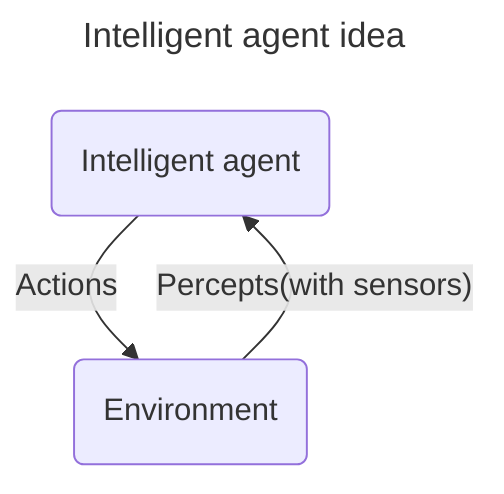
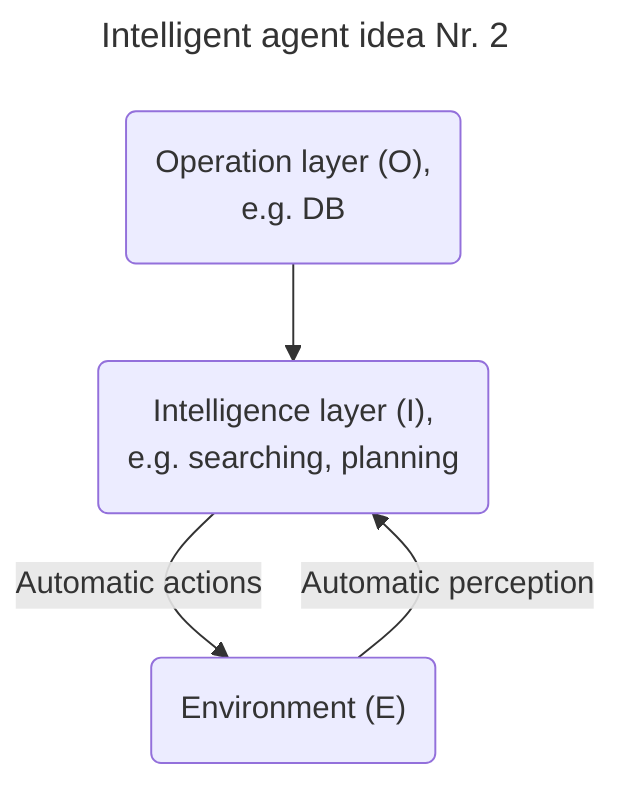
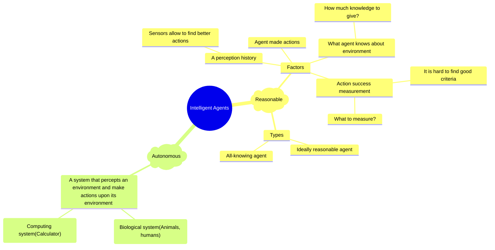
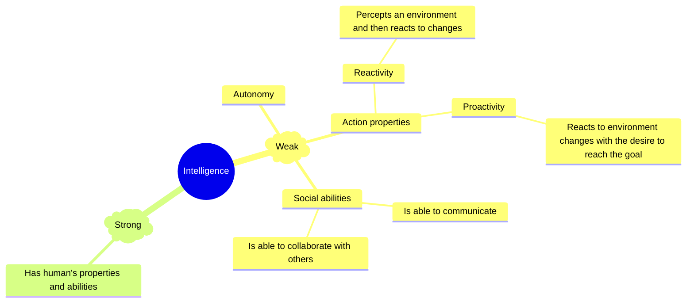
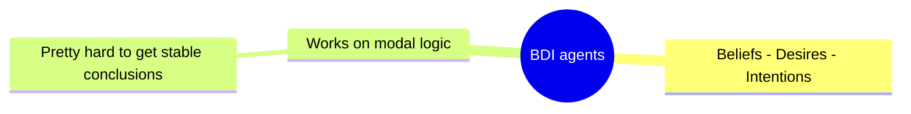
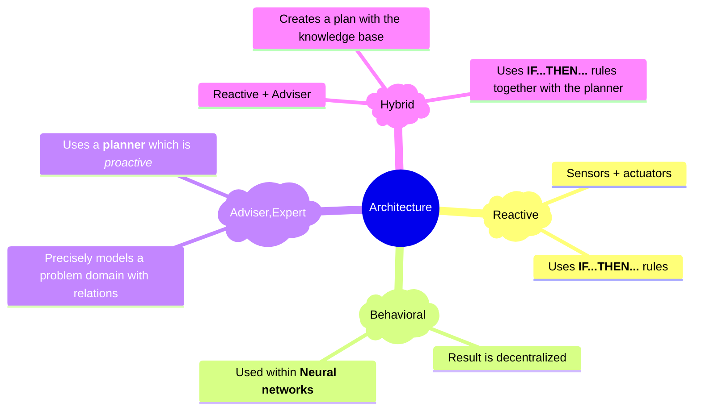

# Diagrams

Compile diagrams with

```bash
mmdc -e png --scale 3 -i diagram.md 
```

Convert TikZ PDF to PNG:

```bash
convert -density 300 pic.pdf -quality 100 pic.png
```


```mermaid
---
title: Intelligent agent idea
---
graph TB
  IA(Intelligent agent)
  E(Environment)

  IA -->|Actions| E
  E -->|"Percepts(with sensors)"| IA
```


```mermaid
---
title: Intelligent agent idea Nr. 2
---
graph TB
  O("Operation layer (O), \n e.g. DB")
  I("Intelligence layer (I), \n e.g. searching, planning")
  E("Environment (E)")

  O --> I
  I -->|Automatic actions| E
  E -->|Automatic perception| I

```


```mermaid
mindmap
  root((Intelligent Agents))
    id)Reasonable(
      Factors
        Agent made actions
        A perception history
          Sensors allow to find better actions
        What agent knows about environment
          How much knowledge to give?
        Action success measurement
          It is hard to find good criteria
          What to measure?
      Types
        Ideally reasonable agent
        All-knowing agent
    id)Autonomous(
      A system that percepts an environment and make actions upon its environment 
        id("Biological system(Animals, humans)")
        id("Computing system(Calculator)")
```


```mermaid
mindmap
  root((Intelligence))
    id)Weak(
      Autonomy
      Action properties
        Reactivity
          Percepts an environment and then reacts to changes
        Proactivity 
          Reacts to environment changes with the desire to reach the goal
      Social abilities
        Is able to communicate
        Is able to collaborate with others
    id)Strong(
      Has human's properties and abilities
```


```mermaid
mindmap
  root((BDI agents))
    Beliefs - Desires - Intentions
    Works on modal logic
      Pretty hard to get stable conclusions 
```


```mermaid
mindmap
  root((Architecture))
    id)Reactive(
      Sensors + actuators
      Uses **IF...THEN...** rules
    id)Behavioral(
      Result is decentralized
      Used within **Neural networks**
    id)Adviser,Expert(
      Precisely models a problem domain with relations
      Uses a **planner** which is _proactive_
    id)Hybrid(
      Reactive + Adviser
      Creates a plan with the knowledge base
      Uses **IF...THEN...** rules together with the planner
```
