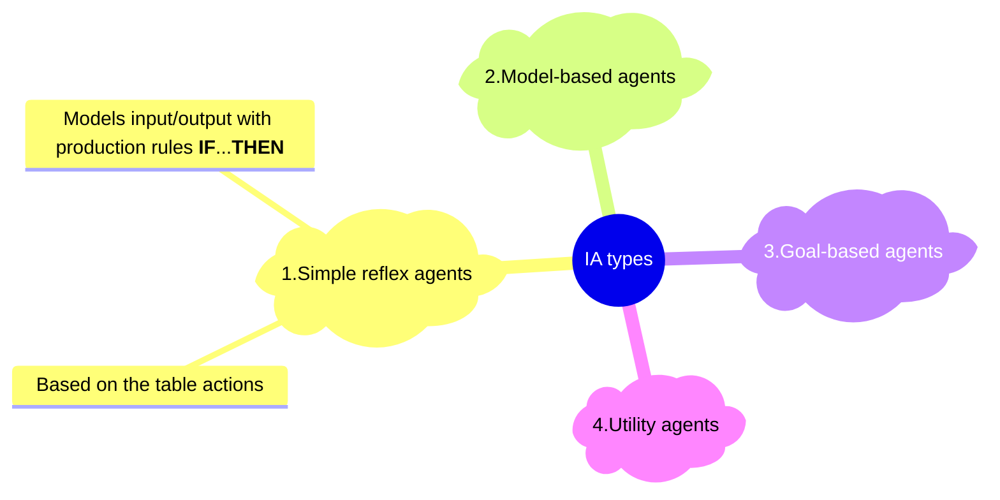

---
header-includes:
  - \usepackage{fancyhdr}
  - \usepackage{lastpage}
  - \pagestyle{fancy}
  - \fancyfoot[CO,CE]{\thepage\ of \pageref{LastPage}}
mainfont: Helvetica
fontsize: 12pt
urlcolor: cyan
author: Alex
date: Feb 11, 2024
geometry: margin=1.5cm
---
# 3 - Intelligent agents(IA)

Compile diagrams with

```bash
mmdc -e png --scale 3 -i diagram.md 
```

Convert TikZ PDF to PNG:

```bash
convert -density 300 pic.pdf -quality 100 pic.png
```

Convert this markdown doc with:

```bash
pandoc -F mermaid-filter diagram.md -o notes.pdf
```

## ToC

## Intelligent agent as a function

As was described in previous lections we can describe intelligent agent as a function:
$$f: P \rightarrow A$$,
where $P$ is a perception set($S$ for sensors in the image) and $A$ is an action set.

{ width=50% }

Agent is a function that is a black box, i.e. we don't know how it produces its results. An agent receives information(perception $P$ or $S$) from sensors, processes them via function($f$) and returns back an action($A$) to do.

The common algorithm of intelligent agent can be described as:

> function $f: P \rightarrow a \in A$ is
> $let$ Knowledge Base : Memory($M$)
>> $update : (M,P) \rightarrow M*$
>> $action : M* \rightarrow a$
>> $update : (M*, a) \rightarrow M**$
>
> return $a$

## Intelligent agent types



## Simple reflex agents

Algorithm can be described the following way:

> function $f_r: P \rightarrow a \in A$ is
>> $let$ $PR$ = production rules - **IF** condition **THEN** action
>> $input \: interpretation : P \rightarrow s_i \in S [state]$
>> $rule \: search : (s_i, PR) \rightarrow p_i \in PR$
>> $rule \: burning : p_i \rightarrow a$
>
> return $a$

Illustration on working principle:


